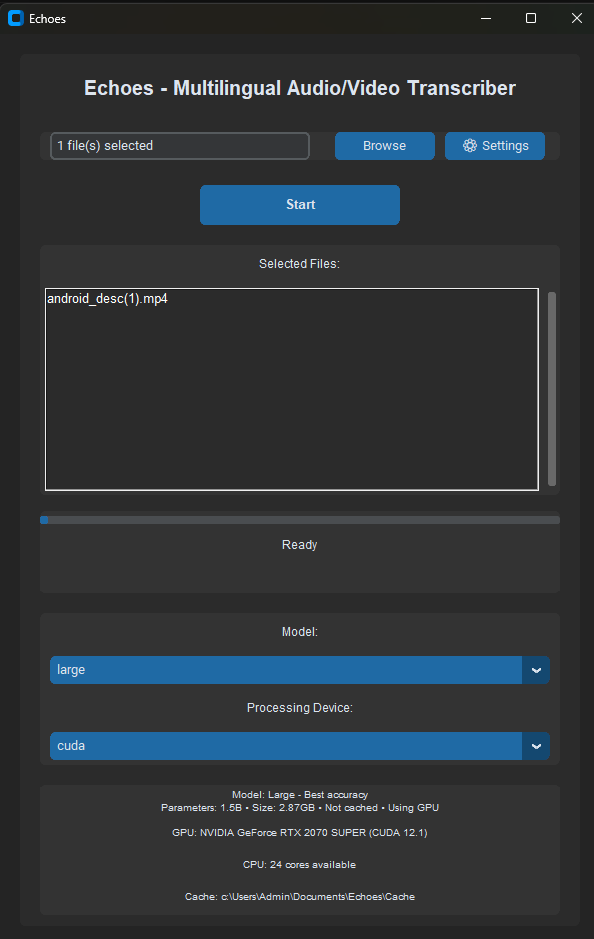

# Multilingual Audio/Video Transcriber

A Python application that transcribes audio and video files into text, supporting multiple languages including English and Chinese. Built with OpenAI's Whisper model and a modern GUI interface.

## Features

- Support for both audio and video files
- Multilingual transcription (auto-detects language)
- High accuracy transcription using OpenAI's Whisper model
- Optional timestamp inclusion in the transcript
- Modern, user-friendly GUI interface
- Multiple model size options for different accuracy/speed trade-offs
- GPU acceleration support (NVIDIA CUDA)
- Multi-core CPU processing support
- Smart model caching system

## Application Interface



## Storage Requirements

The application uses OpenAI's Whisper models which require local storage for caching. Here are the storage requirements for each model:

| Model   | Parameters | Download Size | Description                    |
|---------|------------|---------------|--------------------------------|
| tiny    | 39M       | 75MB          | Fastest, lower accuracy        |
| base    | 74M       | 142MB         | Good balance                   |
| small   | 244M      | 461MB         | Better accuracy                |
| medium  | 769M      | 1.42GB        | High accuracy                  |
| large   | 1.5B      | 2.87GB        | Best accuracy                  |

### Recommended Storage Space
- **Minimum**: At least the size of your chosen model plus 500MB for temporary files:
  - tiny/base: ~1GB free space
  - small: ~1.5GB free space
  - medium: ~2.5GB free space
  - large: ~4GB free space
- **Recommended**: 5GB+ free space if you plan to use multiple models (total ~5.3GB for all models + temp files)
- **Additional**: Extra space needed for temporary audio files during video processing (~500MB-1GB depending on video length)

### Cache Management
- Models are cached in the "Cache" folder in the program's directory
- Cache location can be changed in Settings
- Unused models can be removed through the Settings menu to free up space
- The application will automatically manage temporary files

## System Requirements

### Minimum Requirements
- Python 3.8 or higher
- RAM requirements vary by model:
  - tiny/base: 8GB RAM
  - small: 8GB-12GB RAM
  - medium: 8GB-16GB RAM
  - large: 16GB+ RAM
- Storage space:
  - Minimum: See "Recommended Storage Space" above
  - SSD recommended for faster model loading
- Multi-core CPU (recommended 4+ cores for parallel processing)

### For GPU Acceleration
- NVIDIA GPU with CUDA support
- CUDA Toolkit installed
- Sufficient GPU memory (recommended 4GB+)

### Supported File Formats
- Audio: MP3, WAV
- Video: MP4, AVI, MKV

## Installation

1. Clone this repository or download the files

2. Install FFmpeg if you haven't already:
   - Windows: Download from [FFmpeg website](https://ffmpeg.org/download.html)
   - Linux: `sudo apt-get install ffmpeg`
   - macOS: `brew install ffmpeg`

3. For GPU Acceleration (Recommended for faster processing):
   
   a. Verify NVIDIA GPU Compatibility:
      - Check if you have a CUDA-capable GPU
      - For RTX series (like RTX 2070, 3080, etc.), you're good to go
      - Check compatibility at [NVIDIA's CUDA GPUs list](https://developer.nvidia.com/cuda-gpus)

   b. Install NVIDIA GPU Drivers:
      - Download latest drivers from [NVIDIA Driver Downloads](https://www.nvidia.com/Download/index.aspx)
      - Choose your GPU model and operating system
      - Install the drivers
      - Restart your computer

   c. Install CUDA Toolkit:
      - Download CUDA Toolkit from [NVIDIA CUDA Downloads](https://developer.nvidia.com/cuda-downloads)
      - Select your operating system and version
      - Follow the installation instructions
      - Current recommended version: CUDA 12.1
      - Add CUDA to your system PATH if not done automatically

   d. Install PyTorch with CUDA support:
      ```bash
      pip uninstall torch torchvision torchaudio
      pip install torch torchvision torchaudio --index-url https://download.pytorch.org/whl/cu121
      ```

   e. Verify CUDA Installation:
      - Run the application
      - Check Settings window
      - Look for "GPU: NVIDIA [Your GPU Model]"
      - If not detected, try reinstalling CUDA or updating drivers

4. Install the required Python packages:
   ```bash
   pip install -r requirements.txt
   ```

## Verifying GPU Support

After installation, you can verify GPU support:

1. The application will automatically detect your GPU
2. In the device selection dropdown, you should see "CUDA" as an option
3. The Settings window will show:
   - GPU model name
   - CUDA version
   - Available GPU memory
4. If GPU is not detected:
   - Check NVIDIA Control Panel for driver status
   - Verify CUDA Toolkit installation
   - Try reinstalling PyTorch with CUDA support
   - Make sure your GPU is CUDA-capable

## Usage

1. Run the application:
```bash
python transcriber.py
```

2. In the GUI:
   - Click "Browse" to select your audio or video file
   - Choose the model size (larger models are more accurate but slower)
   - Select processing device (GPU/CPU)
   - Toggle the timestamp option if desired
   - Click "Transcribe" to start the process

3. The transcript will be saved in the same directory as your input file with format: `{original_name}_transcript_{model_name}.txt`

## Model Options

| Model  | Download Size | Speed | Accuracy | Memory Usage |
|--------|--------------|-------|----------|--------------|
| tiny   | 75MB        | Fast  | Basic    | ~1GB        |
| base   | 142MB       | Fast  | Good     | ~1.5GB      |
| small  | 461MB       | Medium| Better   | ~2GB        |
| medium | 1.42GB      | Slow  | High     | ~3GB        |
| large  | 2.87GB      | Slow  | Highest  | ~4GB        |

## Processing Modes

### GPU Processing
- Uses NVIDIA CUDA for acceleration
- Requires compatible NVIDIA GPU with sufficient VRAM:
  - tiny/base: 2GB+ VRAM
  - small: 3GB+ VRAM
  - medium: 4GB+ VRAM
  - large: 6GB+ VRAM
- Shows real-time GPU memory usage
- Generally 3-4x faster than CPU processing

### CPU Processing
- Utilizes multiple CPU cores (up to 75% of available cores)
- Automatically splits audio into chunks for parallel processing
- Recommended RAM:
  - tiny/base: 8GB
  - small: 12GB
  - medium: 16GB
  - large: 16GB+
- Shows real-time CPU and memory usage
- Good fallback when GPU is not available

## Cache System

The application includes a smart caching system for Whisper models:

- Default location: `./Cache` in the application directory
- Customizable location through Settings
- Caches downloaded models for future use
- Shows cache status and download size for each model
- Includes cache management tools:
  - View cached models and sizes
  - Change cache location
  - Clear cache
  - View cache statistics

## Notes

- First-time use will download the selected model (see download sizes above)
- Processing time depends on:
  - File length
  - Selected model size (tiny: fastest → large: slowest)
  - Processing device (GPU typically 3-4x faster than CPU)
  - Available system resources (RAM, VRAM)
- GPU acceleration is automatically used if available
- The application supports mixed-language content
- Progress bar shows real-time processing status
- Memory usage is monitored to prevent system overload
- Temporary files are automatically cleaned up

## Troubleshooting

If you encounter issues:

1. Check system requirements:
   - Verify RAM matches model requirements
   - Ensure sufficient VRAM for GPU processing
   - Check available storage (model size + 300MB for temp files)
2. Storage and Memory:
   - Free up disk space if needed
   - Close memory-intensive applications
   - Try a smaller model if running out of memory
   - Monitor memory usage in Task Manager/Activity Monitor
3. GPU-related:
   - Update GPU drivers
   - Check VRAM availability
   - Monitor GPU temperature
   - Consider CPU mode if GPU memory is insufficient

### GPU-Specific Issues:

1. "CUDA not available" error:
   - Check if NVIDIA drivers are properly installed
   - Verify CUDA Toolkit installation
   - Reinstall PyTorch with CUDA support
   - Make sure your GPU is CUDA-compatible

2. GPU Memory Errors:
   - Switch to a smaller model
   - Check available VRAM in Task Manager
   - Close other GPU-intensive applications
   - Consider using CPU mode if VRAM is insufficient

3. Poor GPU Performance:
   - Monitor GPU temperature (below 80°C ideal)
   - Check GPU utilization in Task Manager
   - Update NVIDIA drivers
   - Ensure proper power settings

4. CUDA Version Mismatch:
   - Verify CUDA version compatibility
   - Reinstall PyTorch with matching CUDA version
   - Update GPU drivers if needed

## Cache Management

The Settings window provides comprehensive cache management:
1. View current cache location and usage
2. Change cache directory
3. Monitor total cache size
4. Clear specific or all cached models
5. View detailed statistics:
   - Model sizes and dates
   - Total space used
   - Available storage

## Notes

- First-time use will download the selected model
- Processing time depends on:
  - File length
  - Selected model size
  - Processing device (GPU/CPU)
  - Available system resources
- GPU acceleration is automatically used if available
- The application supports mixed-language content
- Progress bar shows real-time processing status
- Memory usage is monitored to prevent system overload
- Temporary files are automatically cleaned up

## Troubleshooting

If you encounter issues:

1. Check system requirements
2. Ensure sufficient storage space
3. Update GPU drivers if using CUDA
4. Try a smaller model if running out of memory
5. Check the cache directory permissions
6. Monitor system resource usage during processing

### GPU-Specific Issues:

1. "CUDA not available" error:
   - Check if NVIDIA drivers are properly installed
   - Verify CUDA Toolkit installation
   - Reinstall PyTorch with CUDA support
   - Make sure your GPU is CUDA-compatible

2. GPU Memory Errors:
   - Try a smaller model
   - Close other GPU-intensive applications
   - Update NVIDIA drivers
   - Check GPU temperature and performance

3. Poor GPU Performance:
   - Update NVIDIA drivers
   - Check GPU temperature
   - Ensure proper power management settings
   - Close other GPU-intensive applications

4. CUDA Version Mismatch:
   - Uninstall existing PyTorch
   - Install the correct PyTorch version for your CUDA
   - Verify CUDA Toolkit version matches PyTorch requirements

## Cache Management

Access cache settings through the "Settings" button:
1. View current cache location
2. Change cache directory
3. Monitor cache size
4. Clear cached models
5. View detailed cache statistics

## License

This project is licensed under the MIT License - see the LICENSE file for details. 